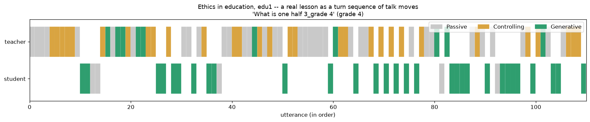
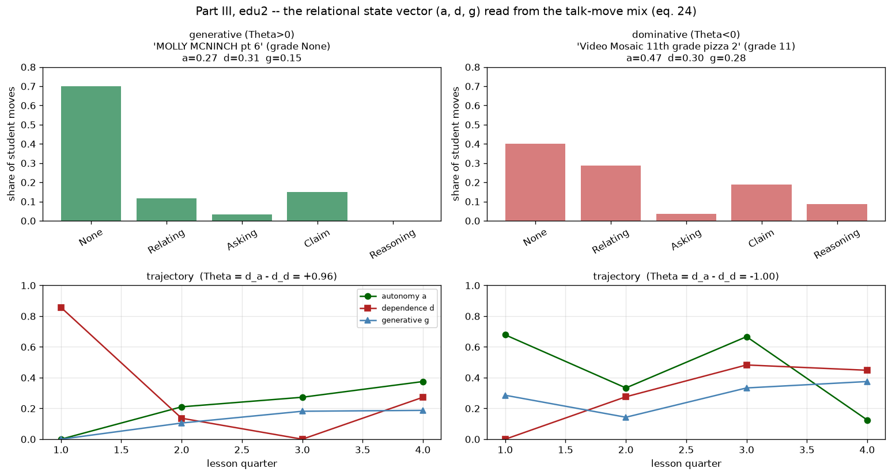
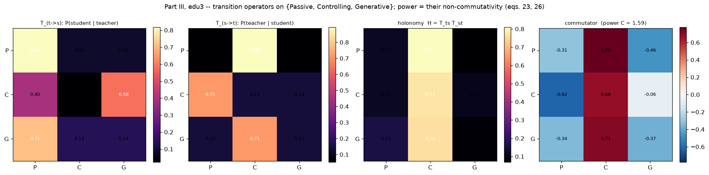
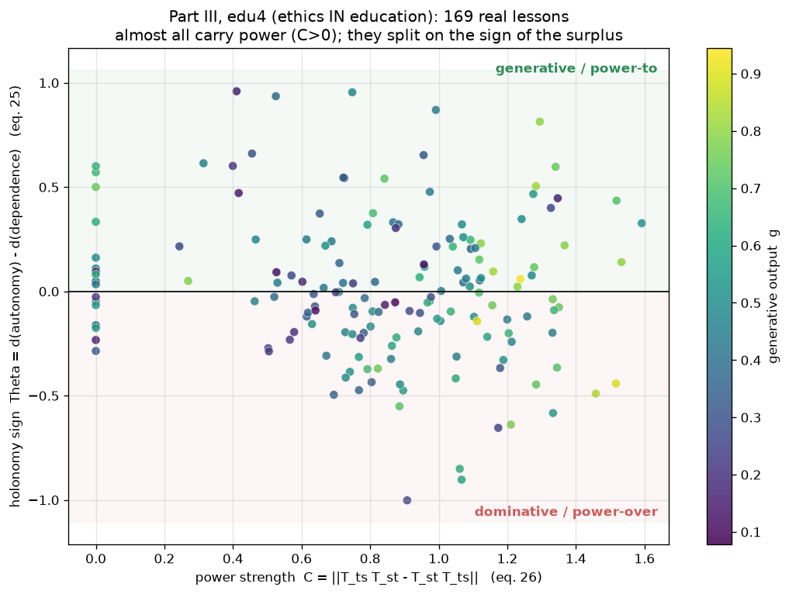
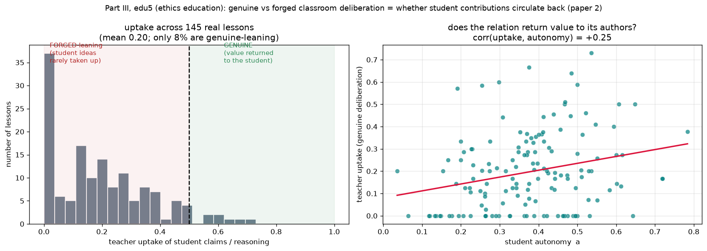
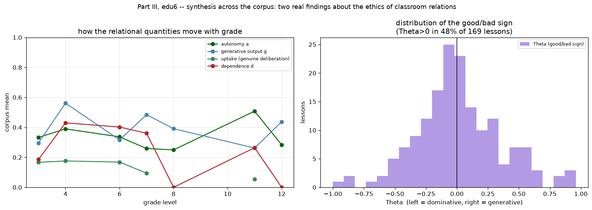

# Figure Gallery

One visualization per formal step of the model, each backed by real computation. Regenerate
the whole set with:

```bash
PYTHONPATH=. python experiments/make_gallery.py     # all figures -> assets/
```

or run any single stage script in `experiments/`. Every figure obeys the model's own limits:
only the **sign, order, and non-commutativity** of a holonomy are ever reported, never an
absolute magnitude (paper §4.5, §10.1).

---

## Stage I — the fluid model (§2)

| Figure | Step | What it shows (computed) |
|--------|------|--------------------------|
|  | continuity with a source (eq. 1) | value stock grows from a source — **not conserved** (total 0.33 → 1.32) |
|  | power = flux history (eq. 3) | power field accumulates where value flowed; α-dominant **remembers**, β-dominant **forgets** |
|  | vorticity & holonomy (eqs. 4–5) | holonomy measured around three relational loops; signs +/+/− match enclosed circulation |
|  | **Proposition 2.1** | appropriation contributes **+3.3e-12** to the holonomy; generation **−0.74** — appropriation is curl-free |
|  | dominance vs generative (Remark 2.1) | unique Helmholtz split: dominance (gradient, curl ≈ 1.7e-13) vs generative (solenoidal, curl 4.75) |
|  | the flow runs | 2D decaying turbulence; enstrophy decays smoothly (viscous solidification) |

## Stage II — the relational field (§4)

| Figure | Step | What it shows |
|--------|------|---------------|
|  | breaking G→H (eq. 7) | Mexican-hat potential with vacuum manifold **M = G/H ≅ S¹**; a realized broken state |
|  | subjects as defects (eq. 9) | 4 placed defects, 4 detected, charges [−1,−1,+1,+1] — **π₁(S¹)=ℤ**, integer winding |
|  | abelian holonomy (eq. 10) | enclosing-loop winding **+1.000**, avoiding-loop **0.000**; holonomy builds over the whole loop |

## Stage II/III — power as non-commutativity (eq. 11)

| Figure | Step | What it shows |
|--------|------|---------------|
|  | abelian vs non-abelian | Bloch sphere: abelian endpoint gap **1.7e-16** (order irrelevant) vs non-abelian **1.58** (order matters = power) |

## Stage III — braid statistics (§4.7–6)

| Figure | Step | What it shows |
|--------|------|---------------|
|  | braid generators & Yang-Baxter (eq. 15) | σ₁σ₂σ₁ = σ₂σ₁σ₂ as isotopic braid diagrams; residual **3e-16** for both reps |
|  | the three non-abelian demands (§5.3) | power (commutator 1.80), resonance (dim Hₙ = Fibonacci), generativity (τ×τ = 1+τ) |
|  | **Proposition 6.1** | Ising = **6 discrete** reachable holonomies (discriminates) vs Fibonacci = **dense** (cannot) |

## Stage IV / V — the protected remainder and the relational base (§7, §9)

| Figure | Step | What it shows |
|--------|------|---------------|
|  | skeleton vs flesh (§7) | under perturbation: holonomy winding **invariant** (+1→+1, skeleton); local detail re-written (flesh, 0.34 rad) |
|  | the relational base (§9) | D₄ Cayley graph as configuration space; field Φ winds once; **r·s ≠ s·r** = power in the base |

## Stage VI — operationalization & the educational case study (§10)

| Figure | Step | What it shows |
|--------|------|---------------|
|  | state vectors (eq. 24) | (autonomy, dependence, generative output) trajectories per cohort |
|  | the geometry of power | the (C, Θ) plane: both cohorts have power C>0, split into power-to (Θ>0) vs power-over (Θ<0) |
|  | **falsifiable prediction** (§10.5) | Θ **separates** cohorts (gap 0.98) while exam scores **overlap** (gap 2.5) — model supported |

---

# Part 2 — The Ethics Model

The same dynamics read in a normative register (see the README's *Part 2* section for the concept
mapping). One figure per claim.

| Figure | Step | What it shows |
|--------|------|---------------|
|  | good/bad criterion | the **sign** of a cycle's holonomy: generative (Θ=+0.90), appropriative (Θ=0), dominative (Θ=−0.54) |
|  | power-to vs power-over | same power (C=0.8), opposite surplus sign; power-to decays toward its own dissolution |
|  | the trilemma (Prop. 4.1) | power and generativity **co-originate** — the curves coincide; "generative yet powerless" is empty |
|  | solidification (§5.3) | α-dominant power = historical drag → vorticity collapses to **1%** (the bad cycle as a process) |
|  | deliberative attractors | fixed point vs limit cycle vs **holonomic spiral** (config returns, value climbs) |
|  | genuine vs forged | sign of the holonomy on the deliberative loop: value **returned** (+0.30) vs **extracted** (−0.18) |
|  | illness | authorship distributed across the care relation; the holonomy sign judges genuine vs forged care |
|  | the intimate trolley | the beloved is off the aggregation axis — non-substitutable; aggregation breaks down |

---

# Part 3 — Case Study: Quantitative Ethics in Real Classrooms

The instrument applied to the **TalkMoves corpus** (169 real K-12 math lessons, grades 3–12;
Suresh et al., LREC 2022). Fetch with `python experiments/fetch_talkmoves.py`, then
`python experiments/edu_casestudy.py`.

| Figure | Step | What it shows (from real data) |
|--------|------|--------------------------------|
|  | the raw data | one lesson as a turn sequence of talk moves (teacher/student × Passive/Controlling/Generative) |
|  | state vector (a,d,g) | two real lessons at the extremes: Θ=+0.96 (generative) vs Θ=−1.00 (dominative) |
|  | transition operators | `T_ts`, `T_st`, the holonomy, and the commutator (power 𝒞=1.59 for this lesson) |
|  | **ethics in education** | the (𝒞, Θ) plane over 169 lessons: mean 𝒞≈0.82, Θ>0 in 48% — power-to vs power-over |
|  | **ethics education** | teacher uptake (mean 0.20, 8% genuine); corr(uptake, autonomy)=+0.25 |
|  | synthesis | the quantities by grade; the Θ distribution (symmetric around 0) |

---

### Module map

| Module | Provides |
|--------|----------|
| `fluid_socio/grid.py` | periodic 2D grid, spectral operators |
| `fluid_socio/operators.py` | Helmholtz decomposition, holonomy diagnostics |
| `fluid_socio/fluid.py` | value/power flow (vorticity–streamfunction) |
| `fluid_socio/field.py` | order-parameter field, topological defects, U(1) holonomy |
| `fluid_socio/nonabelian.py` | SU(2) path-ordered holonomy, non-commutativity, Bloch sphere |
| `fluid_socio/braid.py` | braid representations (Ising, Fibonacci), Yang-Baxter, reachable sets |
| `fluid_socio/ethics.py` | §10 operationalization: state vectors, transition operators, Θ, C |
| `fluid_socio/deliberation.py` | deliberation dynamics: the three attractors, holonomy on the deliberative loop |
| `fluid_socio/education.py` | Part 3: ingest TalkMoves transcripts → (a,d,g), transition operators, Θ, 𝒞, uptake |
