# Fluid Dynamics in Sociological Systems

A computational realization of the value/power model of Huang, *From Fluid to Braid*
(`papers/fluid_to_braid-v2.pdf`), built to make the model's central claims **runnable,
visual, and falsifiable** rather than only stated. The companion case study,
*Authorship Without Equilibrium* (`papers/authorship_without_equilibrium.pdf`), applies the
same holonomy criterion to deliberative justice.

The full distillation of both papers — every formula tagged by epistemic status — is in
[`NOTES.md`](NOTES.md).

---

## The one idea

> **Genuine relational value is non-possessive.** It is the **holonomy** (the path-dependent
> residue of a closed loop), not a stock held at a point. Whatever in a relation reduces to a
> single scalar ordering — accumulation, ranking, priced exchange — is *curl-free* and generates
> nothing around a loop. **Power** is the **non-commutativity** of that holonomy: the fact that
> the order of acts changes the outcome.

Everything below builds the machinery to make those two sentences precise, computable, and
testable against data.

## The arc of the formalism

The paper proceeds as a deliberate chain, and so does the code. Each layer **generates** the
next; the right-hand boundary (why the symmetry breaks) is declared out of scope.

```
 fluid model            a first, failed field theory — but yields one exact theorem (Prop 2.1)
      │  self-undermines (conserves what should be generated; presupposes a background)
      ▼
 symmetry pre-structure G
      │  spontaneous breaking  G → H        (given, not explained)
      ▼
 order-parameter space  M = G/H             subjects = topological defects  π_k(G/H)
      │
      ▼
 surplus = holonomy  P exp ∮ A              power = non-commutativity (iff H non-abelian)
      │
      ▼
 braid statistics  π₁(Cₙ(Σ)) = Bₙ(Σ)        non-abelian yet non-universal representation
      │
      ▼
 dynamical layer: the fluid flow reinstated — now running on the generated structure
      │
      ▼
 operationalization: sign(Θ), power 𝒞 — falsifiable, scale-invariant, tested on education
```

## The plan

1. **Simulator** — the fluid layer on a periodic grid. Demonstrates Proposition 2.1, the flow
   dynamics, and solidification. *(done — Part 1)*
2. **Foundations** — the symmetry-breaking field, topological defects, non-abelian holonomy, and
   braid statistics. *(done — Part 1)*
3. **Ethics model** — the dynamics read normatively: the good/bad criterion, power-to vs
   power-over, the trilemma, solidification, deliberation dynamics, and the test cases, plus the
   §10 discretization (Θ, 𝒞). *(done — Part 2)*
4. **Empirical study** — the educational case study; currently on synthetic cohorts, next on
   real interaction data. *(synthetic done; real data is the open next step)*

This document is in two parts: **Part 1 — The dynamics** (the formalism, step by step) and
**Part 2 — The Ethics Model** (the same dynamics read normatively, with the concept→computation
mapping).

A guiding discipline, taken from the papers themselves: only the **sign, order, and
non-commutativity** of a holonomy are ever reported — never an absolute magnitude (§4.5, §10.1).

---

# Part 1 — The dynamics, step by step

Each figure below is produced by real computation (the relevant `experiments/` script), not
drawn by hand. Regenerate them all with `PYTHONPATH=. python experiments/make_gallery.py`.

## Stage I — the fluid model (§2)

The most natural continuous model of value: a density `ρ(x,t)` carried by a velocity field
`u(x,t)`, with a power field `p`. It is the *wrong* foundation (it conserves value and assumes a
fixed background) but it yields the one exact theorem the whole framework rests on.

**Value is generated, not conserved** — the continuity equation carries a source:

  ∂ₜρ + ∇·(ρu) = S(ρ, ψ)        *(eq. 1)*

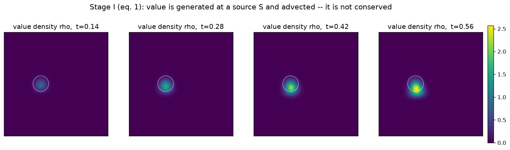

*A localized source S injects value; the swirl advects it. Total stock grows 0.33 → 1.32 — value
emerges, it is not merely moved. The bare presence of S ≠ 0 is already the departure from real
fluid dynamics.*

**Power is the history of value flux** — reinforced where value flowed, forgotten otherwise:

  ∂ₜp = α J − β p,  J = ρu        *(eq. 3)*

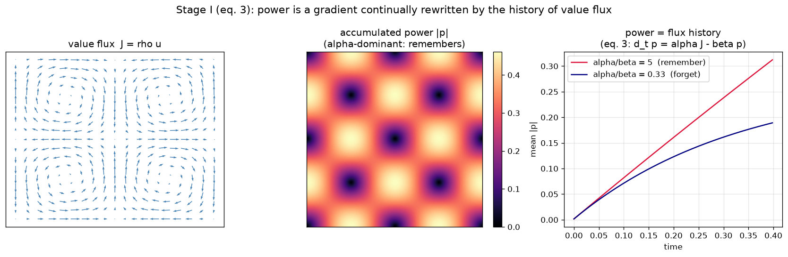

*The ratio α/β is the solidification order parameter: α-dominant power **remembers** its history
(and would lock the flow into a frozen channel); β-dominant power **forgets** and the flow stays
live.*

**The normative object is circulation, not velocity** — the holonomy of a closed loop:

  ω = ∇×u,   hol(γ) = ∮_γ u·dℓ = ∫_Σ ω·dA        *(eqs. 4–5)*

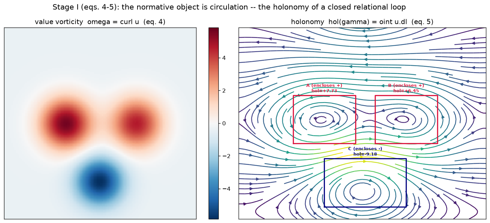

*Three relational loops measured directly: two enclose positive circulation (+7.7, +6.4), one
negative (−9.2). The holonomy is the net value generated by traversing the loop once — the
criterion separating generative cycles from degenerate ones.*

**Proposition 2.1 — appropriation generates no circulation.** Taking the curl of the momentum
equation annihilates the pressure (appropriative) gradient, because ∇×∇P = 0. A purely
appropriative flow has zero holonomy.

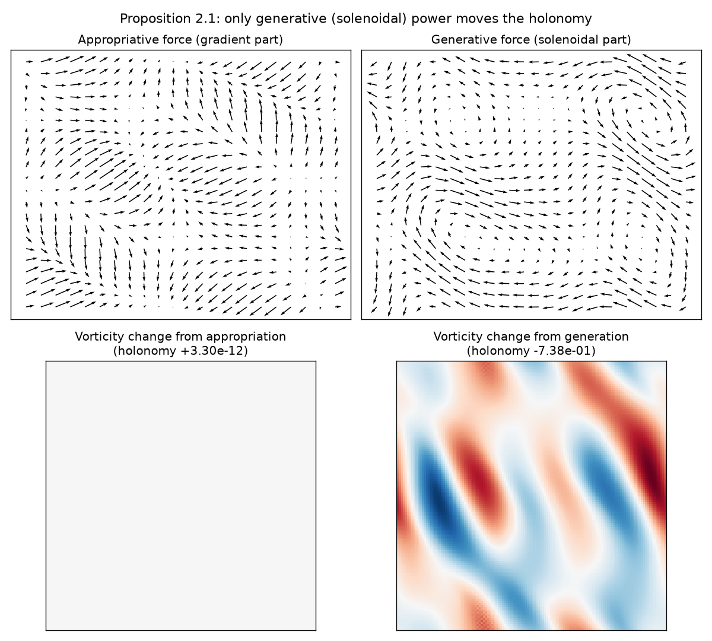

*Splitting a power force into its gradient (appropriative) and solenoidal (generative) parts, then
evolving the flow under each: the appropriative part contributes **+3.3×10⁻¹²** to the holonomy
(a blank field, numerically zero); the generative part contributes **−0.74** (rich circulation).
This is the model's single exact theorem, and it is enforced as a unit test the code cannot break.*

**Dominating vs generative power** is the unique Helmholtz split of the power force (Remark 2.1):

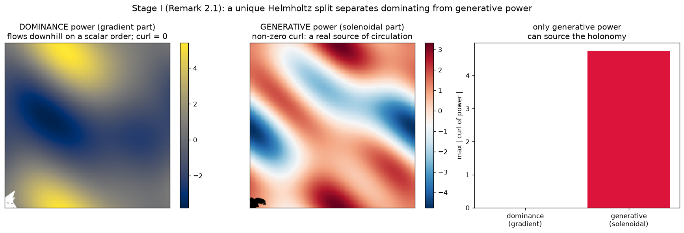

*The gradient part is a dominance landscape — flow downhill on a scalar order, curl ≈ 1.7×10⁻¹³
(zero). Only the solenoidal part (curl 4.75) can source the holonomy. "Dominating" vs "generative"
power is exactly gradient vs solenoidal.*

The flow, run on its own (no power coupling), is stable 2D decaying turbulence:

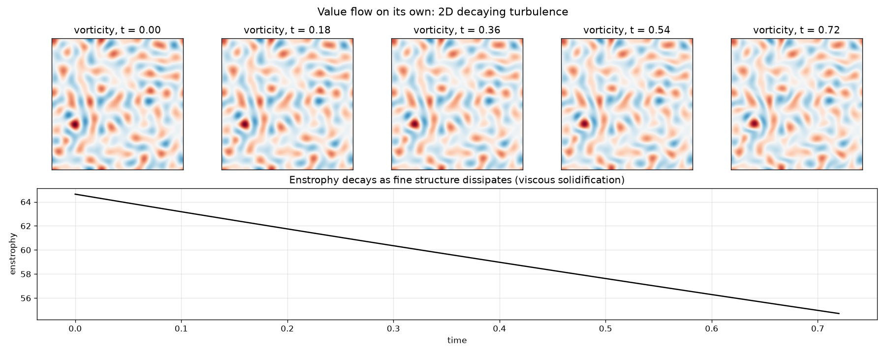

*Like vortices merge, fine structure dissipates, enstrophy decays smoothly — the viscous sense of
"solidification."*

## Stage II — the relational field (§4)

The real foundation. Instead of positing entities, take a symmetry group `G` as pure relation and
let **spontaneous symmetry breaking** `G → H` generate everything else.

**The order-parameter space is generated, not chosen:**

  M = G/H,   subjects = defects of type  π_k(G/H)        *(eqs. 7, 9)*

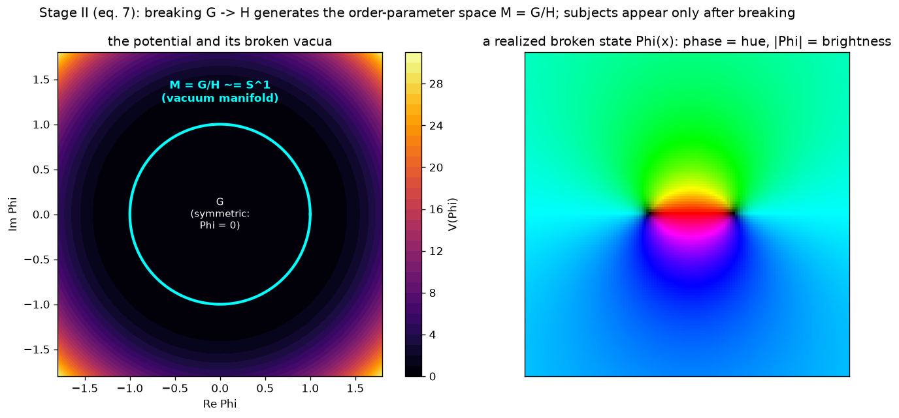

*The Mexican-hat potential and its circle of broken vacua — the vacuum manifold M = G/H ≅ S¹. A
realized broken state assigns a phase at each point; subjects appear only after breaking.*

**Subjects are topological defects.** For M ≅ S¹, π₁(S¹) = ℤ: a subject is an integer winding,
its persistence the conservation of that integer rather than the endurance of any inner core.

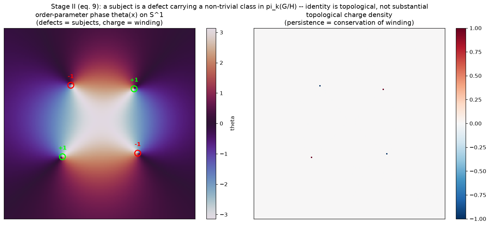

*Four defects placed, four detected, charges [−1, −1, +1, +1]. Identity is topological, not
substantial. The localized charge density on the right is the conserved winding.*

**The surplus is the holonomy of the canonical connection** — and it sees only the enclosed charge:

  hol(γ) = P exp ∮_γ A        *(eq. 10)*

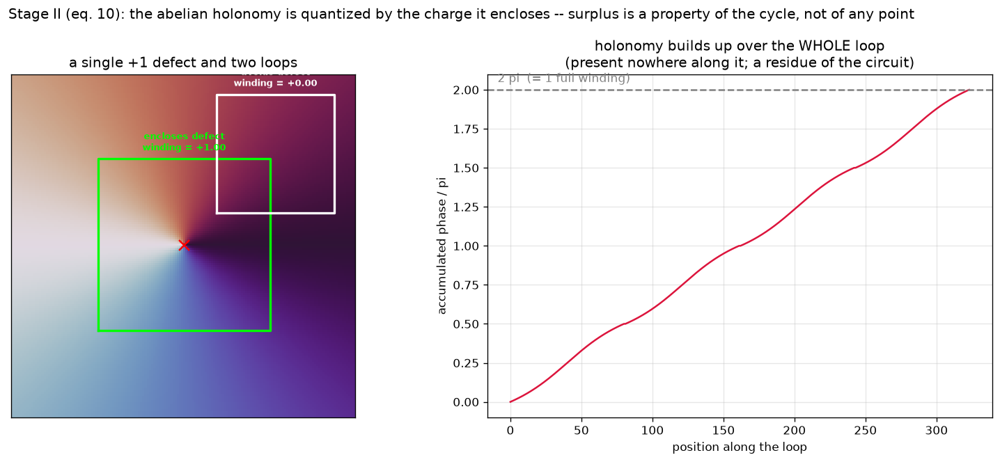

*A loop enclosing the defect has winding +1.000; a loop avoiding it, 0.000. The holonomy builds up
over the *whole* loop (right panel) — present nowhere along it, a residue of the complete circuit.
This is surplus as against stock: the stock Φ(x) is local and appropriable; the surplus is not.*

**Power is the non-commutativity of holonomy**, arising exactly when the residual symmetry H is
non-abelian:

  H abelian ⇒ hol(γ₁)hol(γ₂) = hol(γ₂)hol(γ₁);  H non-abelian ⇒ they differ        *(eq. 11)*

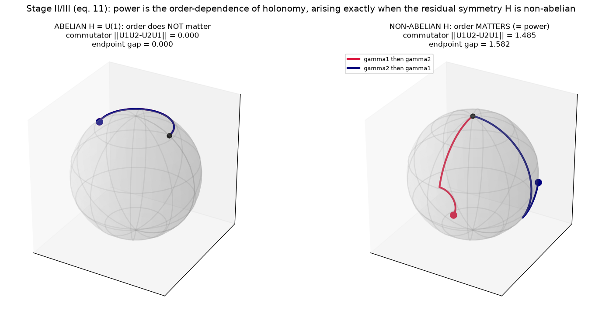

*On the Bloch sphere S² = SU(2)/U(1): for an abelian residue the two traversal orders land on the
same point (gap 1.7×10⁻¹⁶); for a non-abelian residue they diverge (gap 1.58). "Order changes
outcome" *is* non-commutativity — the formal mark of power.*

## Stage III — braid statistics and the discrimination constraint (§4.7–6)

The statistics of `n` indistinguishable defects is the braid group, **computed** (not posited) as
the fundamental group of their configuration space:

  Cₙ(Σ) = (Σⁿ \ Δ)/Sₙ,   π₁(Cₙ(Σ)) = Bₙ(Σ)        *(eqs. 12–13)*

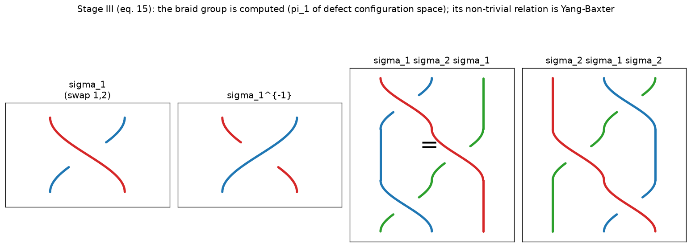

*The generators σᵢ and the one non-trivial relation, Yang-Baxter: σ₁σ₂σ₁ = σ₂σ₁σ₂, drawn as two
isotopic braids. Both representations used below satisfy it to 3×10⁻¹⁶.*

**Three features of relational value each force a non-abelian representation** (§5.3):

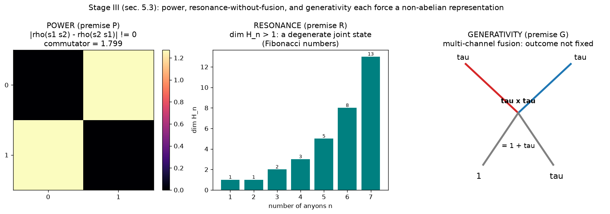

*Power (premise P): ρ(σ₁σ₂) ≠ ρ(σ₂σ₁), commutator 1.80. Resonance (premise R): the fusion space
has dimension > 1 — the Fibonacci numbers. Generativity (premise G): multi-channel fusion
τ × τ = 1 + τ, the outcome not fixed by the inputs.*

**Proposition 6.1 — discriminating power requires non-universality.** A representation powerful
enough to compute anything (a dense, universal image) cannot carry a robust good/bad criterion;
the reachable holonomies must be constrained.

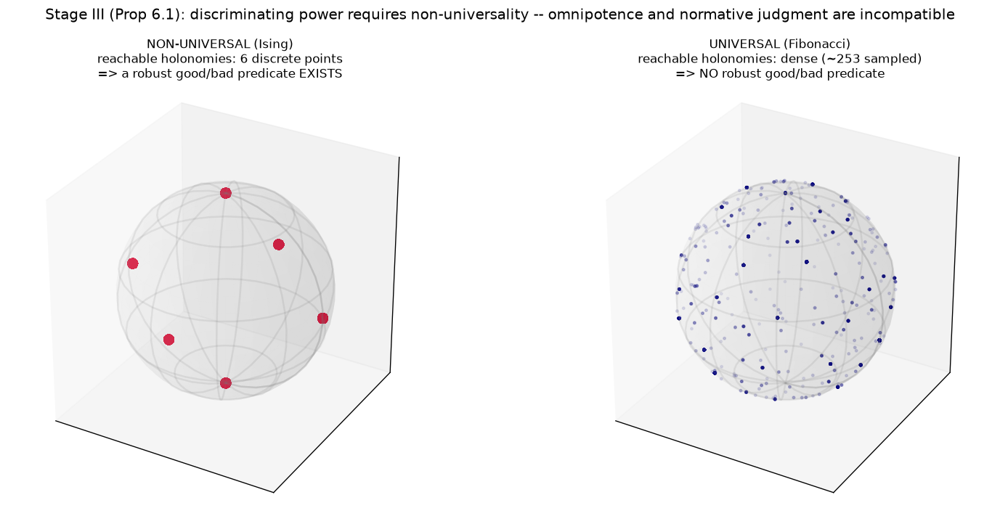

*The reachable holonomy set, sampled as Bloch points. The **Ising** (Clifford) representation is
non-abelian but **finite** — 6 discrete points, so a robust good/bad predicate exists. The
**Fibonacci** representation is **universal** — dense on the sphere, so no robust predicate can. The
correct object is non-abelian yet non-universal.*

## Stage IV / V — the protected remainder and the relational base (§7, §9)

**Value = topological skeleton + local flesh.** The holonomy is robust to local perturbation — which
makes it the right carrier of a good/bad criterion, but blind to singular detail.

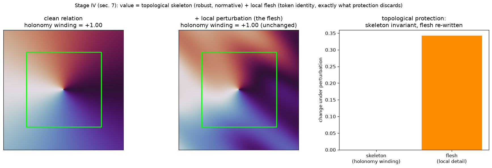

*Under a local perturbation, the enclosed holonomy winding is invariant (+1 → +1, the **skeleton**,
which carries the normative content), while the pointwise detail is re-written (the **flesh**, 0.34
rad — token identity, the non-substitutable particularity of *this* relation). The model predicts the
exact formal location of irreplaceability: the perturbation-sensitive data that protection discards.*

**The aggressive limit: the configuration space is itself a group** (group field theory, §9), so even
the arena is relational:

  Φ: Γ → M,   power = g g′ ≠ g′ g

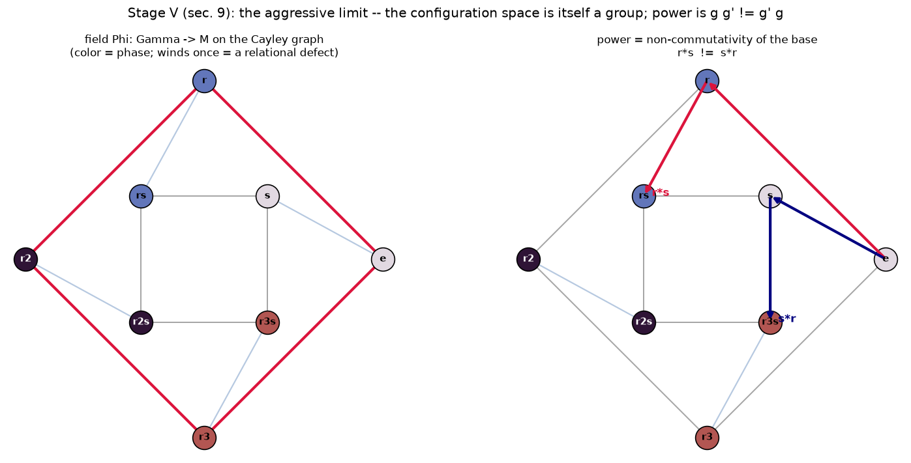

*The D₄ Cayley graph as configuration space. A field Φ winds once around the rotation 4-cycle (a
relational defect). And r·s ≠ s·r — the base itself is non-commutative, so power is literally the
non-commutativity of relational composition.*

## Stage VI — operationalization and the educational case study (§10)

The bridge to data. The continuous holonomy discretizes to a product of estimated transition
operators around a relational cycle:

  Ĥ(γ) = T_{i→j} T_{j→i}        *(eq. 23)*

Each node carries a relational state vector:

  s_i(t) = ( a_i(t), d_i(t), g_i(t) ) = (autonomy, dependence, generative output)        *(eq. 24)*

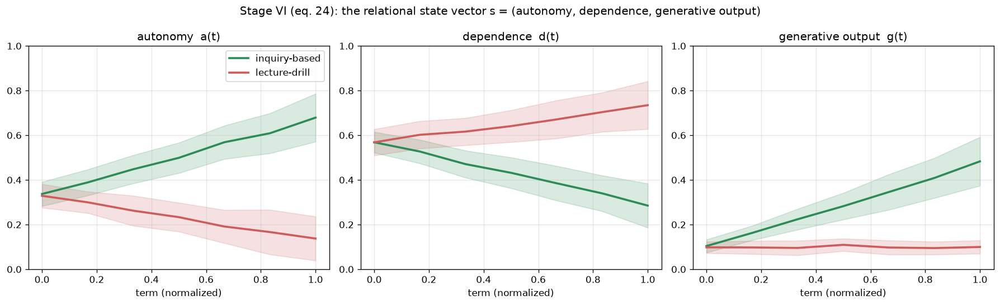

*Two synthetic teaching cohorts. Inquiry-based: autonomy rises, dependence falls, generative output
grows. Lecture-drill: the reverse.*

Two scale-invariant quantities are computed — and only these:

  Θ = Δa − Δd        sign of the holonomy: generative (>0) / appropriative (≈0) / dominative (<0)  *(eq. 25)*
  𝒞 = ‖ T_{i→j}T_{j→i} − T_{j→i}T_{i→j} ‖        strength of power = non-commutativity  *(eq. 26)*

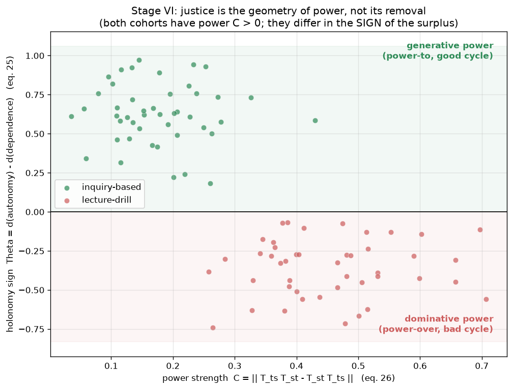

*The (𝒞, Θ) plane. Both cohorts carry power (𝒞 > 0); they differ in the **sign** of the surplus.
Inquiry sits in the generative half (power-to, good cycle); lecture-drill in the dominative half
(power-over, bad cycle), and further right (more power). **Justice is the geometry of power, not its
removal** — a corollary of the structural theorem, made into a measurement.*

**The falsifiable prediction (§10.5):** good teaching shows as Θ > 0 *independent of exam score*.

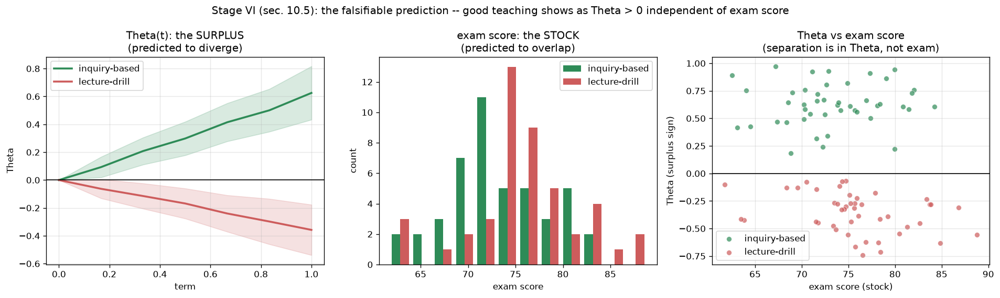

*Θ separates the cohorts (gap 0.98) while exam scores overlap (gap 2.5). A score-based evaluation
sees comparable cohorts; the holonomy reading sees a generative cycle vs an extractive one. On this
synthetic data the model is supported; the verdict rule is explicit and could falsify it.*

---

# Part 2 — The Ethics Model

The dynamics of Part 1 are not a metaphor decorating an ethics; read in a normative register,
**they are the ethics.** The wager is that ethical facts about a relation — is it good, is it
just, is this power care or domination — are facts about *how value circulates in it*, computed
from the very same holonomy the fluid and braid layers define. Ethics here is **bottom-up and
relational**: the good is not a content handed down from outside (no external "conception of the
good," no *Festsetzung*) but a property that emerges from the structure of relational value itself.

### The model in five claims

1. **The good is non-possessive circulation.** Value that a closed relational cycle generates and
   returns — a non-zero **holonomy** — is the good; value merely *appropriated* (transferred as
   stock down a gradient) generates nothing (**Proposition 2.1**). To grasp at the surplus is to
   collapse it back into stock and halt the generation. *(This is the Daodejing's "generating yet
   not possessing," given a precise body.)*

2. **Power is ineliminable.** Any relation rich enough to be generative necessarily carries power:
   power, resonance, and generativity are three faces of one condition — a non-abelian residual
   symmetry (**Prop. 4.1**). A generative world without power is structurally impossible, so ethics
   cannot be the *abolition* of power.

3. **Justice is the geometry of power, not its removal.** Since power cannot be removed, the only
   coherent justice is *shaping* it: making the unavoidable asymmetry **generative** (power-to — the
   surplus returns, serves the other's capacity, works toward its own dissolution: teaching,
   nurturing, guiding) rather than **dominative** (power-over — the surplus is retained, the other
   fixed in dependence). The two are the *same* non-commutativity, differing in the **sign of the
   holonomy**.

4. **Injustice is solidification.** Dynamically, the bad cycle is the collapse of a living,
   circulating structure into a frozen, appropriative channel (vorticity → 0). Justice then has a
   dynamical reading: keep the relation away from the solidified fixed point — keep value circulating.

5. **Genuine vs forged deliberation** *(the* Authorship Without Equilibrium *case study).* When
   those bound by a judgement are also its authors, **genuine** deliberation is a positive-holonomy
   **spiral** — a cycle that returns to its questions while carrying value forward to the
   participants who generate it. **Forged** deliberation keeps the *form* while extracting value:
   zero or negative holonomy, the affected used as fuel. The good attractor is therefore not a
   **fixed point** (reflective equilibrium — settledness mistaken for success) but a spiral.

And one boundary: value has two parts. The **skeleton** (holonomy, type, the good/bad criterion) is
topologically protected — robust, the bearer of normative content. The **flesh** (token identity,
the irreplaceable particularity of *this* relation) is exactly what protection discards. The good is
the right *proportion* of the two; the model locates, but cannot compute, the flesh.

### How the ethical concepts map to the computational model

This is the bridge: every normative term names a specific object in the dynamics of Part 1.

| Ethical concept | Computational object | Where |
|---|---|---|
| value (the good that circulates) | the **holonomy** `hol(γ) = ∮ u·dℓ = P exp ∮ A` | eqs. 5, 10 |
| **stock** (what can be possessed) | local density `ρ(x)` / field value `Φ(x)` | eq. 1 |
| **surplus** (what only circulation makes) | the holonomy of a closed loop | eq. 10 |
| appropriation / possession | the **gradient (curl-free)** part of the flow → zero holonomy | Prop. 2.1 |
| generative value | the **solenoidal** part / non-zero vorticity `ω` | Remark 2.1 |
| a subject | a **topological defect**, type `π_k(G/H)` | eq. 9 |
| **power** | **non-commutativity** of the holonomy (`H` non-abelian) | eq. 11 |
| power-to (generative power, care) | a **positive-holonomy** cycle, `Θ > 0` | §4.4, eq. 25 |
| power-over (domination) | a **negative-holonomy** cycle, `Θ < 0` | §4.4, eq. 25 |
| the good cycle / the bad cycle | the **sign** of the holonomy | §10.4 |
| strength of power | the non-commutativity `𝒞 = ‖[T_ts, T_st]‖` | eq. 26 |
| justice | shaping the **sign/geometry** of an ineliminable power | §4.4 |
| injustice as a process | **solidification**: collapse to a frozen gradient, `ω→0` | §5.3 |
| token identity / irreplaceability | the **flesh** — perturbation-sensitive local data | §7 |
| genuine deliberation | positive holonomy on the deliberative cycle | paper 2, §5 |
| forged deliberation (using as fuel) | zero / negative holonomy | paper 2, §5 |
| reflective equilibrium (rejected) | a **fixed-point** attractor | paper 2, §3 |
| authorship sustained over time | a **holonomic spiral** (config returns, value does not) | paper 2, §3, 5 |

The educational operationalization already shown in **Stage VI** is the first concrete instrument of
this model: `Θ` reads the *sign* of the holonomy (good/bad), `𝒞` reads the *strength* of the power.

### The ethics model, step by step

The Part-2 gallery walks these claims the way Part 1 walked the formalism — each a runnable figure.

**The good/bad criterion is the sign of a cycle's holonomy.**

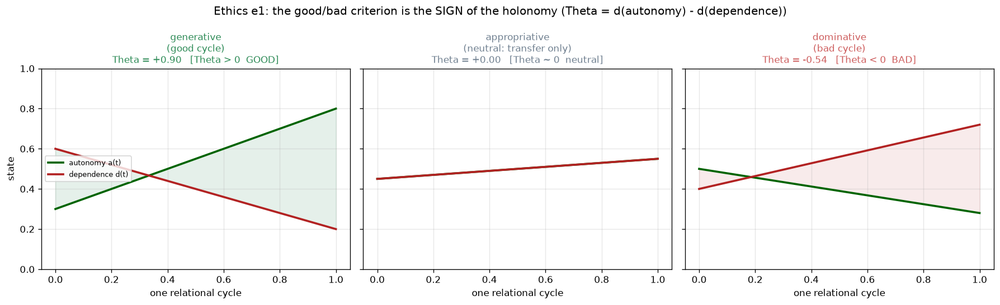

*Three archetypal relations over one cycle. **Generative** (Θ = +0.90, autonomy up / dependence
down): a good cycle. **Appropriative** (Θ = 0.00, autonomy and dependence rise together — pure
transfer leaving the asymmetry untouched): neutral, no surplus. **Dominative** (Θ = −0.54): a bad
cycle. The good/bad verdict is read off the sign, never a magnitude.*

**Power-to and power-over are one non-commutativity in two geometries.**

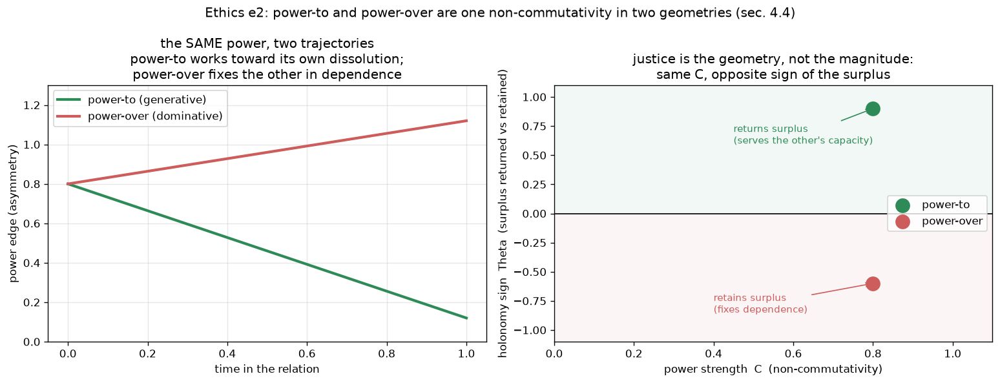

*The same power strength (C = 0.8), opposite sign of the surplus. Power-to's asymmetry *decays
toward zero* — it works toward its own dissolution (teaching, nurturing); power-over's asymmetry
grows — it fixes the other in dependence. Justice is the geometry, not the magnitude.*

**Power and generativity co-originate — the trilemma (Prop. 4.1).**

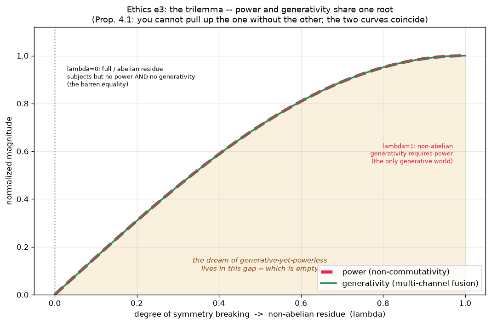

*As the residual symmetry goes from abelian (λ=0) to non-abelian (λ=1), power and generativity rise
*together* — the two curves coincide. A generative-yet-powerless relation would live in the gap
between them, which is empty. You cannot pull up the one without the other, so justice cannot be the
abolition of power.*

**Injustice is solidification — the dynamical death of a generative cycle.**

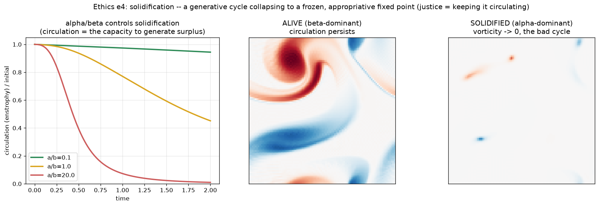

*Using the simulator with accumulated power as historical drag: when power forgets (β-dominant) the
circulation persists (94%); when it remembers without limit (α-dominant) the drag freezes the flow
and vorticity collapses to **1%** — the bad cycle as a process. Justice has a dynamical reading: keep
the relation away from the solidified fixed point.*

**The three candidate attractors of deliberation** *(Authorship Without Equilibrium).*

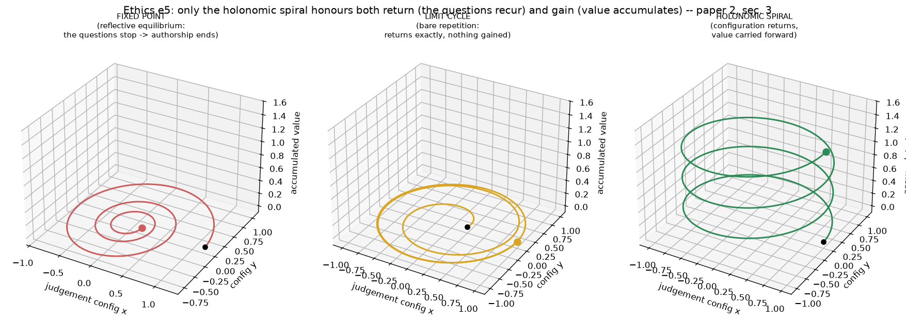

*A fixed point (reflective equilibrium — the questions stop, authorship ends), a limit cycle (bare
repetition — returns exactly, nothing gained), and the **holonomic spiral** — the configuration
returns (the questions recur) while value accumulates (a rising helix). Only the spiral honours both
return and gain.*

**Genuine vs forged deliberation is the sign of the holonomy on the loop.**

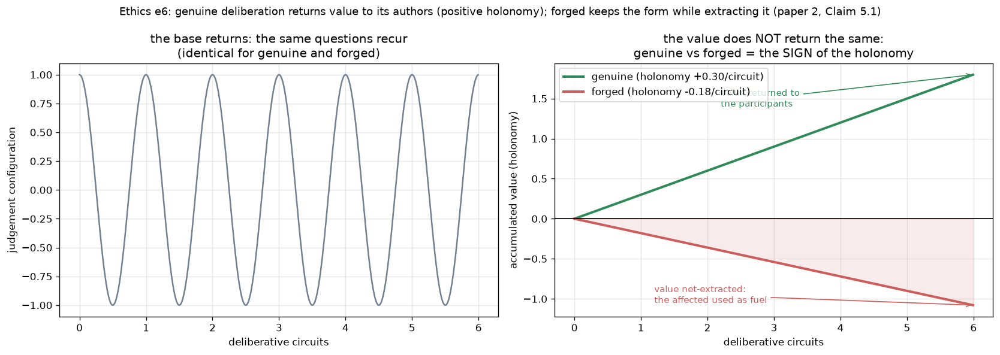

*The base configuration returns identically for both (the same recurring questions). The value does
not: **genuine** deliberation accumulates a positive holonomy — value returned to its authors;
**forged** deliberation keeps the form while net-extracting value (the affected used as fuel).*

**Two hard cases, unintelligible on the equilibrium picture, tractable here.**

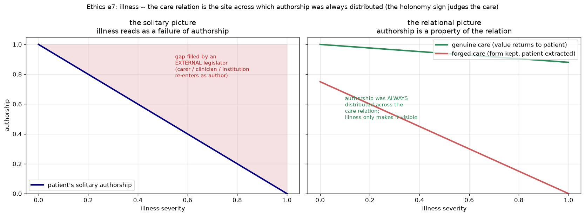

*Illness. On the solitary picture authorship collapses and an external legislator fills the gap. On
the relational picture authorship was always distributed across the care relation — illness only
makes it visible — and the holonomy sign distinguishes genuine care (value returns to the patient)
from forged.*

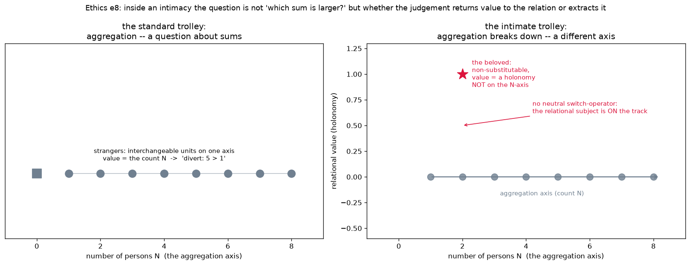

*The intimate trolley. Strangers are countable, interchangeable units on the aggregation axis; the
beloved is non-substitutable — a holonomy *off* that axis. There is no neutral switch-operator,
because the relational subject is on the track. The question is not "which sum is larger?" but
whether the judgement returns value to the relation or extracts it.*

---

# Using the code

```bash
pip install -r requirements.txt

# from the repository root (Windows venv shown; adjust the interpreter path as needed):
PYTHONPATH=. python tests/test_operators.py         # verify the core (incl. Proposition 2.1)
PYTHONPATH=. python experiments/make_gallery.py     # regenerate every figure -> assets/
PYTHONPATH=. python experiments/stage6_ethics.py    # or run any single stage
```

### Package map

| Module | Provides |
|--------|----------|
| `fluid_socio/grid.py` | periodic 2D grid with exact spectral operators (grad, div, curl, Laplacian, Poisson) |
| `fluid_socio/operators.py` | Helmholtz decomposition, holonomy / circulation diagnostics, sign-only reporting |
| `fluid_socio/fluid.py` | the value/power flow as a vorticity–streamfunction model (eqs. 1–6, 17–19) |
| `fluid_socio/field.py` | order-parameter field, topological defects (winding), U(1) holonomy |
| `fluid_socio/nonabelian.py` | SU(2) path-ordered holonomy, non-commutativity, Bloch sphere |
| `fluid_socio/braid.py` | braid representations (Ising, Fibonacci), Yang-Baxter check, reachable sets, fusion dims |
| `fluid_socio/ethics.py` | the §10 operationalization: state vectors, transition operators, Θ, 𝒞 |
| `fluid_socio/deliberation.py` | deliberation dynamics: the three attractors, holonomy on the deliberative loop |

`experiments/` has one script per stage (`stage*.py` for Part 1, `ethics_*.py` for Part 2) plus
`make_gallery.py`, which regenerates all 26 figures; `tests/` holds the regression tests; figures
land in `assets/` (indexed in [`GALLERY.md`](GALLERY.md)).

### Invariants the code respects (from the papers' own limits)

1. **Never report an absolute holonomy magnitude** — only sign / order / non-commutativity are
   meaningful (§4.5, §10.1).
2. **Stock and surplus are separate** — local density `ρ` / phase `Φ(x)` vs. non-local circulation.
3. **A pure-gradient force leaves the holonomy invariant** (Proposition 2.1) — enforced as a test.
4. **Every output is tagged by epistemic status** — a theorem's exactness never leaks silently into
   an interpretive claim.

### Honest notes — what is exact, computed, synthetic, or illustrative

The source papers fix a discipline: a *theorem* is exact, an *argument from adequacy* is conditional,
an *interpretation* the formalism cannot establish, and some things are *open*. The figures here
inherit that grading. Read each in the right register:

- **Exact (a mathematical fact, computed to machine precision).** Proposition 2.1 — appropriation
  contributes ~10⁻¹² to the holonomy (fig. 04, and a regression test); the Helmholtz curl identity
  (05); abelian winding quantization (08); the Yang-Baxter residuals ~10⁻¹⁶ (10); the abelian vs
  non-abelian commutator gap (09); Prop. 6.1's finite-vs-dense reachable sets (12). These are true by
  the mathematics, independent of any interpretation.

- **Faithful computation (the model genuinely running).** The fluid flow and continuity/power
  dynamics (01–03, flow demo); **solidification** (e4) — the simulator actually collapsing under the
  drag law; topological defects (06–07); the trilemma's SU(2) commutator-vs-mixing curves (e3); the
  braid fusion dimensions (11); skeleton/flesh robustness (16); the group-field base (17); the
  integrated deliberation attractors and genuine/forged staircase (e5–e6). Real computation, but
  resting on modeling choices (below).

- **Synthetic data (a falsifiable *prediction*, not a measurement).** The educational case study
  (13–15) runs on a synthetic generative model of two cohorts. It *reproduces* the §10.5 prediction
  (Θ separates, exam score does not); it does **not** show the prediction holds of real classrooms.

- **Illustrative (a schematic of a claim, with chosen numbers).** e1 (three archetypal Θ
  trajectories), e2 (chosen power trajectories), e7 (chosen authorship curves), e8 (a conceptual
  diagram). These make the *structure* of a claim visible; they are not derived from data and their
  numbers are stipulated.

**Modeling decisions worth knowing.**

- The simulator is **2D**, which drops the vortex-stretching term `(ω·∇)u` (it vanishes in 2D), so
  the only circulation source is `∇×f_pow` — the sharpest Prop. 2.1 demo, but self-amplifying
  generative cycles would need 3D.
- **Solidification** is realized as accumulated power acting as *historical drag* (friction ~ `|p|²`).
  The paper motivates this ("viscosity is relational inertia or historical drag") but does not fix the
  force law `f(p)`; this is a stipulation, chosen because the naive coupling `f(p)=p` amplifies rather
  than freezes the flow.
- The deliberation **fibre bundle** (e5–e6) is a structural analogy, exactly as paper 2 states — not
  a claim that deliberation is literally a connection on a manifold.
- The correspondence between a real relationship and a particular symmetry `G, H` has **no canonical
  form** (§4.5); every operationalization here is an operational stipulation, not a measurement of an
  underlying symmetry.

**What is *not* done.** Real (non-synthetic) empirical validation; a normatively-interpretable robust
invariant in the non-abelian non-universal band (the central open problem of §6, marked but unsolved);
the origin of `G` and the cause of symmetry breaking (out of scope by construction).
